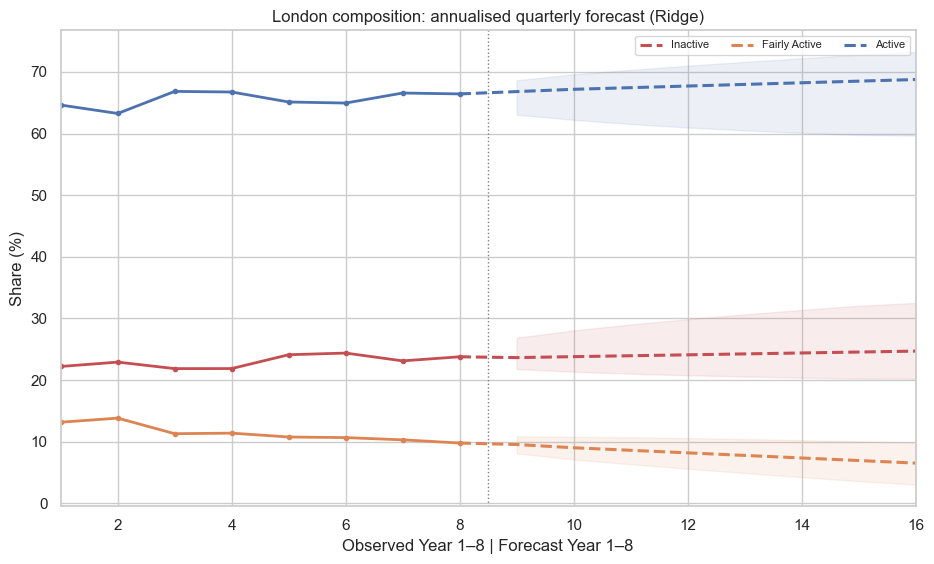
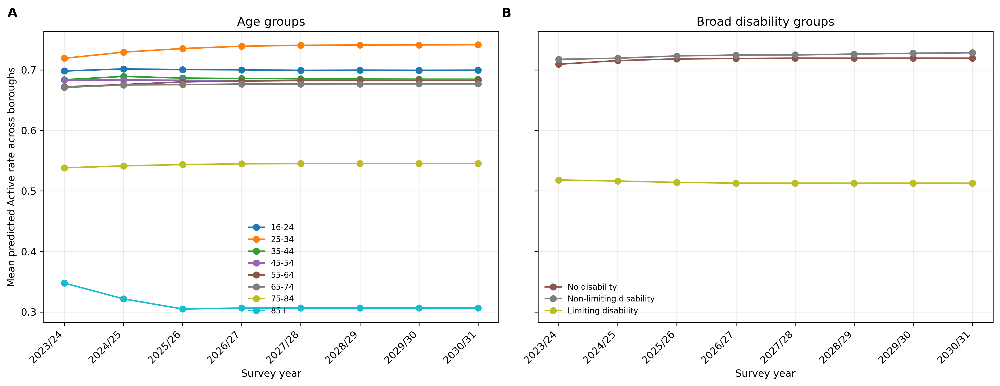
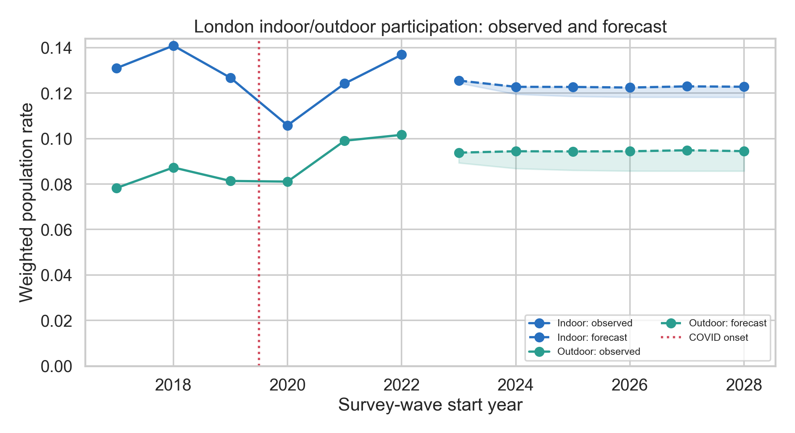
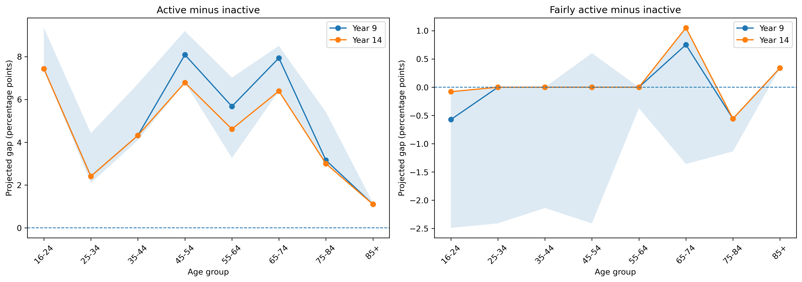

# London Sport 2

### Forecasting Physical Activity Participation, Volunteering and Activity Patterns in London

A machine-learning analysis of Sport England's Active Lives Adult Survey across London and its boroughs.

## About the project

London Sport needs forward-looking evidence to decide where support is most needed, which groups may face persistent barriers, and how future provision could balance physical activity, indoor and outdoor opportunities, and volunteering.

This repository contains the analysis developed for **London Sport 2**, an MSc group dissertation in Engineering Mathematics at the University of Bristol. It uses Sport England's [Active Lives Adult Survey](https://datacatalogue.ukdataservice.ac.uk/series/series/2000120#access-data) to study London overall, Inner and Outer London, and the 32 London boroughs outside the City of London.

The project combines survey-weighted descriptive analysis with chronological model evaluation. It compares simple persistence forecasts with Ridge Regression, Random Forest and Gradient Boosting, then uses the selected models to produce medium-term planning scenarios.

> The forecasts are conditional, model-based scenarios. They should not be read as causal estimates, exact future values or policy targets.

## Research questions

| | Question | Data period | Forecast period | Project area |
|---|---|---:|---:|---|
| **RQ1** | How might physical activity levels change across London, Inner and Outer London, and individual boroughs? | 2015/16-2022/23 | 2023/24-2030/31 | [London and borough activity](./Yifeng%20Mao/) |
| **RQ2** | How might activity levels and participation change across age and disability groups, and which activities are expected to have the highest participation? | 2015/16-2022/23 | 2023/24-2030/31 | [Age and disability](./Jingyi%20Hua/) |
| **RQ3** | How might indoor and outdoor participation change across London and its boroughs, and how does the balance differ by activity level? | 2017/18-2022/23 | 2023/24-2028/29 | [Indoor and outdoor activity](./Siyan%20Xin/2017~2022/) |
| **RQ4** | How might frequent sport volunteering change by borough, age and activity level, and how does the activity-level gap vary with age? | 2017/18-2022/23 | 2023/24-2028/29 | [Frequent sport volunteering](./Shuhan%20Zhao/volunteer_analysis/) |

## Key findings

### RQ1 - London and borough activity

London's **Active** share increased from **64.6% to 66.4%** between 2015/16 and 2022/23. At the same time, **Inactive** increased from **22.2% to 23.8%**, while **Fairly Active** fell by 3.4 percentage points. This is better understood as a shift towards both ends of the activity distribution than as a uniform improvement.

Borough differences remained persistent and spatially clustered. Formal annual model selection retained Naive persistence for London and Inner/Outer London and Ridge Regression for the boroughs. The annual evidence did not establish one clear long-term direction for London overall. A supplementary annualised quarterly scenario suggested that London's Active share could rise by approximately 2.0 percentage points by 2030/31, but this is a secondary scenario rather than the main forecast result.

  

<em>Observed London activity composition and the supplementary annualised quarterly scenario. Shading shows sensitivity bands, not prediction intervals.</em>

### RQ2 - Age and disability

Gradient Boosting was selected for six of the eight forecasting tasks. On the independent 2022/23 test, it reduced error relative to Naive by **29.1%** for disability-specific activity composition and **26.2%** for overall disability-group composition.

Most age-group forecasts were relatively stable, but people aged 75-84 and 85+ remained at substantially lower predicted Active rates. The limiting-disability group also remained below the no-disability group throughout the selected-model forecast. Active Travel and Gardening frequently appeared among the activities with the highest predicted participation. The exact long-term path for the 85+ group and the disability gap was more sensitive to model choice than the broad group differences.

  

<em>Mean predicted Active rates across boroughs by age and broad disability group, 2023/24-2030/31.</em>

### RQ3 - Indoor and outdoor activity

Random Forest was selected for both annual and monthly forecasts. On the untouched 2022/23 test, it reduced total-variation error relative to Naive by **18.2% annually** and **17.6% monthly**.

The projected indoor exposure share in 2028/29 was **56.5%** under a persistent-COVID-legacy scenario and **58.0%** under a recovery scenario. Indoor exposure is the share of recorded indoor settings among all recorded indoor and outdoor exposures; it is not the percentage of residents who participate indoors. Active respondents had a lower observed indoor exposure balance than the other activity-level groups.

  

<em>Observed and projected London indoor and outdoor participation rates. The shaded area is the range between the two COVID scenarios, not a prediction interval.</em>

### RQ4 - Frequent sport volunteering

The selected models were Random Forest for the borough-by-activity-level task and Gradient Boosting for the borough-by-age and borough-by-age-by-activity-level tasks. On the independent 2022/23 test, they reduced effective-sample-size-weighted MAE by **17.0%-24.5%** relative to Naive.

The forecasts retained a clear activity-level ordering: frequent volunteering was highest among the Active group. Across borough medians, ages 16-24 had the highest projected rate and ages 85+ the lowest. Detailed borough-by-age-by-activity-level estimates have weaker sample support and should be interpreted more cautiously than the broader patterns.

  

<em>Projected volunteering-rate gaps by age. Year 9 is 2023/24 and Year 14 is 2028/29; shading shows the interquartile range across boroughs.</em>

## Data and definitions

The project uses two harmonised versions of the survey data:

| Analysis dataset | Coverage | Records | Activity coverage | Used for |
|---|---:|---:|---:|---|
| Eight-wave dataset | 2015/16-2022/23 | 135,497 London respondent records | 124 activities available across all eight waves | RQ1 and RQ2 |
| Six-wave dataset | 2017/18-2022/23 | 96,629 London respondent records | 179-activity dictionary | RQ3 and RQ4 |

For overall physical activity, Active Lives classifies adults as:

- **Active:** at least 150 minutes of moderate-intensity activity per week;
- **Fairly Active:** 30-149 minutes per week; and
- **Inactive:** fewer than 30 minutes per week.

Survey weights are used to estimate participation rates. Kish effective sample size is retained alongside subgroup estimates because a cell can represent a large population while still being based on limited respondent information. Missing, inapplicable and invalid responses remain missing; valid zeroes remain zero.

For RQ3, 146 activities contained the required participation and setting fields in every included wave. Each respondent was classified as `indoor only`, `outdoor only`, `both` or `neither recorded`. The last category does **not** mean Inactive: it can also include qualifying activity for which no indoor/outdoor setting was recorded.

## Model evaluation

The evaluation design preserves time order:

- RQ1 and RQ2 use four expanding-window validation folds based on the eight available survey waves.
- RQ3 and RQ4 use three expanding-window validation folds based on the six available survey waves.
- In every research question, **2022/23 is reserved as an independent test wave** and does not influence model or hyperparameter selection.

Total variation distance is used for multi-category compositions, while mean absolute error is used for individual participation and volunteering rates. After independent testing, the selected model is refitted on all observed waves and projected recursively. Historical recursive backtests and sensitivity analyses are used to show where longer-term results become less certain.

The wider analysis also includes temporal decomposition, age standardisation, multilevel modelling, spatial autocorrelation, borough clustering, partial pooling and compositional data transformations.

## Repository guide

The repository is organised by contributor and research strand. Detailed notebook descriptions and run instructions are kept close to the relevant code.

| Area | Contents | Where to start |
|---|---|---|
| [`Yifeng Mao/`](./Yifeng%20Mao/) | RQ1 data preparation, multilevel analysis, borough clustering and forecasting | [RQ1 README](./Yifeng%20Mao/README.md) |
| [`Jingyi Hua/`](./Jingyi%20Hua/) | RQ2 age/disability data, modelling, forecasts, backtests and robustness analysis | [`notebooks/`](./Jingyi%20Hua/notebooks/) |
| [`Siyan Xin/2017~2022/`](./Siyan%20Xin/2017~2022/) | RQ3 harmonisation, modelling, forecasts and audit outputs | [RQ3 README](./Siyan%20Xin/2017~2022/Q3_README.md) |
| [`Shuhan Zhao/volunteer_analysis/`](./Shuhan%20Zhao/volunteer_analysis/) | RQ4 panel construction, historical analysis, model comparison and future projections | [`volunteer_analysis/`](./Shuhan%20Zhao/volunteer_analysis/) |

For the detailed RQ3 outcome definitions, validation rules and sensitivity design, see the [RQ3 methods notes](./Siyan%20Xin/2017~2022/q3_outputs/METHODS_README.md).

## Reproducing the analysis

Processed datasets and saved outputs are included with each research strand. Available run instructions and project folders are linked above. Rebuilding from source requires the relevant Active Lives survey files; RQ1 additionally uses ONS, Metropolitan Police and London borough boundary data.

## How to interpret the results

The strongest evidence comes from one-year-ahead independent testing and the earlier recursively backtested horizons. Later forecasts have less direct empirical support because the historical series contain only six or eight annual waves.

Active Lives is a repeated cross-sectional survey, so changes describe London populations at different points in time rather than changes within the same individuals. Fine borough and demographic cells can also be sparse. Read these results together with their effective sample sizes, model comparisons and sensitivity checks.

COVID-period indicators and recovery scenarios describe alternative model assumptions. They do not isolate the causal effect of the pandemic. Likewise, the uncertainty ranges in the analyses are sensitivity summaries rather than calibrated prediction intervals.

## Data sources

The principal source is Sport England's [Active Lives Adult Survey](https://datacatalogue.ukdataservice.ac.uk/series/series/2000120#access-data). The final two waves correspond to UK Data Archive studies **9136** and **9288**, documented in the [Year 7 technical report](https://doc.ukdataservice.ac.uk/doc/9136/mrdoc/pdf/9136_active_lives_survey_year_7_technical_report.pdf) and [Year 8 technical report](https://doc.ukdataservice.ac.uk/doc/9288/mrdoc/pdf/9288_active_lives_survey_full_year_8_technical_report.pdf).

RQ1 also uses ONS population and residence-based earnings data and Metropolitan Police recorded-crime data. Survey data, documentation and derived outputs remain subject to the conditions of their original providers.

## Team

| Contributor | Contribution |
|---|---|
| **Siyan Xin** | RQ3 - indoor and outdoor participation |
| **Jingyi Hua** | RQ2 - age and disability forecasting |
| **Shuhan Zhao** | RQ4 - frequent sport volunteering |
| **Yifeng Mao** | RQ1 - London and borough activity |

**Supervisor:** Dr Dalila O'Grady  
**Teaching Assistant:** Alex Williams  
**Programme:** MSc, Faculty of Science and Engineering, University of Bristol  
**Project Partner:** London Sport

## Licence

No repository-wide software licence is currently included. Data-source terms apply independently.

## Acknowledgements

The team thanks Dr Dalila O'Grady for supervision, Alex Williams for teaching support, London Sport for shaping the project questions, and Sport England and the UK Data Service for providing the Active Lives Adult Survey and its documentation.
